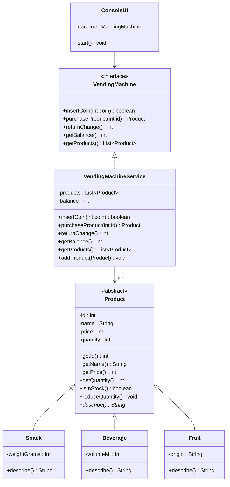

```mermaid
classDiagram

    class Product {
        <<abstract>>
        -id : int
        -name : String
        -price : int
        -quantity : int
        +getId() int
        +getName() String
        +getPrice() int
        +getQuantity() int
        +isInStock() boolean
        +reduceQuantity() void
        +describe() String*
    }

    class Snack {
        -weightGrams : int
        +describe() String
    }

    class Beverage {
        -volumeMl : int
        +describe() String
    }

    class Fruit {
        -origin : String
        +describe() String
    }

    class VendingMachine {
        <<interface>>
        +insertCoin(int coin) boolean
        +purchaseProduct(int id) Product
        +returnChange() int
        +getBalance() int
        +getProducts() List~Product~
    }

    class VendingMachineService {
        -products : List~Product~
        -balance : int
        +insertCoin(int coin) boolean
        +purchaseProduct(int id) Product
        +returnChange() int
        +getBalance() int
        +getProducts() List~Product~
        +addProduct(Product) void
    }

    class ConsoleUI {
        -machine : VendingMachine
        +start() void
    }

    Product <|-- Snack
    Product <|-- Beverage
    Product <|-- Fruit

    VendingMachine <|.. VendingMachineService

    VendingMachineService --> "0..*" Product

    ConsoleUI --> VendingMachine
```